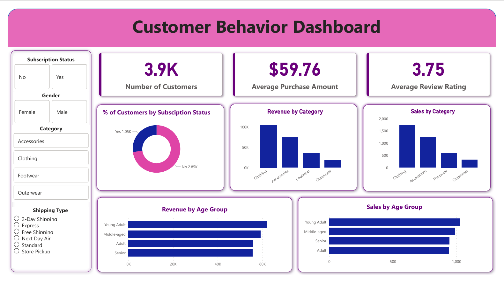

# 🧠 Customer Shopping Behavior Analysis

## 📋 Overview  
This project analyze **customer purchasing patterns** using transactional data from 3900 purchase across various product categories, identifies **spending patterns, customer segment, product preferences and subscription behavior**, and highlights **actionable insights** to guide strategic business decisions.  
A complete **data analytics pipeline** was built using:  
- **Python** for data loading, cleaning, and preprocessing  
- **SQL** for exploratory data analysis (EDA) 
- **Power BI** for interactive data visualization and insight presentation

---

## 🛠️ Tools & Technologies  

| Category | Tools Used |
|-----------|-------------|
| **Programming** | Python (Pandas, NumPy) |
| **Database** | PostgreSQL |
| **Visualization** | Power BI |
| **Environment** | Jupyter Notebook|

---

## 🔍 Project Steps  

### 1️⃣ Data Loading  
- Imported dataset into **Python** using `pandas`.  
- Verified data types, structure, and null values in **Python**.

### 2️⃣ Data Cleaning & Transformation  
- Handled missing values, inconsistent data types.  
- Standardized categorical values and formatted columns.  
- Exported the cleaned dataset for SQL analysis and dashboarding.

### 4️⃣ SQL Analysis  
- Loaded data into **PostgreSQL**.  
- Performed analysis using SQL queries:
  - Aggregations and groupings  
  - Filtering and joins for deeper insights  

### 5️⃣ Dashboard Development (Power BI)  
- Connected dataset or SQL source to **Power BI**.  
- Designed an interactive dashboard highlighting:
  - Key performance indicators (KPIs)  
  - Category breakdowns  
  - Drill-through and filter functionality   

---

## 📊 Dashboard  
- **Tool:** Power BI  
- **Access:**   
- **Key Features:**  
  - Interactive filters and slicers  
  - KPI visuals and trend charts  

---

## 📈 Results & Insights  
- Identified **key business insights**, such as:
  - Revenue by gender 
  - High spending discount users  
  - Top 5 rated products and top categories
  - Impact of shipping preference on purchase
  - Revenue generated by each age group  
  - Customer segmentation
- Delivered **data-driven recommendations** for decision-making.  

---
